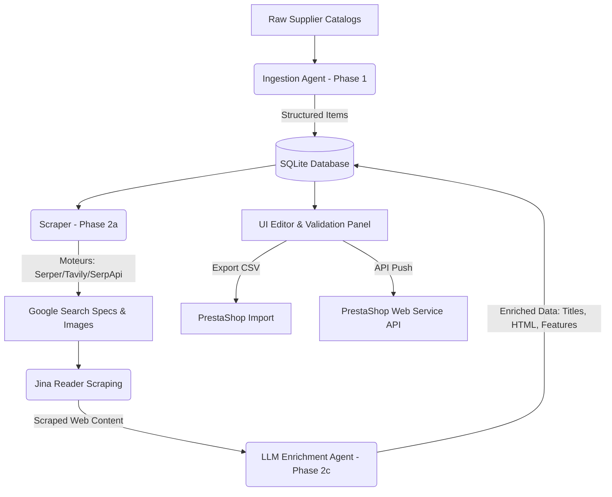

# MediaVision AI Product Enrichment Pipeline

> **AI Agent e-commerce catalog enrichment pipeline, built for MediaVision Tunisia.**

This project is a web application (Node.js/Express) that automates the extraction, web search, and enrichment of supplier product datasheets to prepare them for **PrestaShop** imports. It turns raw supplier product text blocks into fully-featured e-commerce products with accurate specifications and high-resolution images.

---

## 🚀 Key Features

1. **Raw Data Ingestion (Phase 1):** Copy-paste raw text blocks from supplier catalogs, invoices, or pricelists. The Ingestion AI Agent automatically parses and structures this information (SKU/Reference, Brand, Raw Price, Commercial Title, Initial Specs).
2. **Automated Web Search (Phase 2a & 2b):** Automatically query Google (via **Serper.dev**, **SerpApi**, or **Tavily**) for product specification pages and product images.
3. **LLM Enrichment (Phase 2c):** The Enrichment AI Agent processes the scraped web content, validates it against the initial supplier data, and outputs:
   - A clean consumer title in French/English.
   - A professionally-formatted HTML description (using semantic elements like `<p>`, `<ul>`, `<li>` without messy inline styles or CSS classes).
   - An SEO-optimized meta-description (seo_excerpt).
   - Technical features mapped to PrestaShop reference features.
   - Automatic category matching in the MediaVision store catalog.
4. **Visual Image Validation:** Review and select images retrieved from the web with automated link-existence checks (filters out broken or 404 image links).
5. **PrestaShop Export:** Generate CSV files matching PrestaShop standard import layouts (semicolon-delimited UTF-8 with BOM for easy Excel editing).
6. **API Sync:** Direct sync to push products to the PrestaShop back office via the PrestaShop Web Service API.

---

## 🛠️ Project Architecture

The pipeline uses a modern, lightweight, and fast tech stack:

* **Backend:** Node.js with the **Express** framework.
* **Database:** **SQLite** (via high-performance native driver `better-sqlite3` configured in WAL mode).
* **Frontend:** Single Page Application (SPA) built with HTML5, modern CSS3 (CSS custom properties, Flexbox/Grid, transitions), and Vanilla JavaScript.
* **AI Agents & Services:**
  * **LLM Models:** Direct integrations with **Google Gemini API**, **OpenAI API**, and **OpenRouter** (supporting models like Gemini 2.5 Flash and GPT-4o-mini).
  * **Scraping & Search:** Serper.dev, SerpApi, Tavily, and Jina Reader (`https://r.jina.ai`) for reading raw web content.



---

## 🔒 Security and Confidentiality (Public-Safe)

This repository is designed to be **completely safe for public hosting on GitHub**:
* **No credentials or API keys are hardcoded** in the source code.
* All sensitive API credentials (OpenAI/Gemini keys, Serper keys, PrestaShop store URLs and tokens) are configured dynamically by the user via the in-app **Settings panel** at runtime.
* Configurations are saved locally in the SQLite database's `settings` table (`data/mediavision.db`).
* The local SQLite database folder (`data/`), Node dependencies (`node_modules/`), and local environment configurations are explicitly excluded from Git in `.gitignore` to prevent any credential leaks.

---

## 📁 Directory Structure

```text
├── data/                  # Local SQLite database (Git-ignored)
├── public/                # Static SPA Frontend
│   ├── app.css            # Modern app styling
│   ├── app.js             # Frontend SPA logic
│   └── index.html         # Application markup
├── src/                   # Backend Node.js code
│   ├── routes/            # Express API Endpoints
│   │   ├── enrich.js      # Enrichment process flow
│   │   ├── export.js      # CSV exporting handlers
│   │   ├── ingest.js      # Raw text ingestion handlers
│   │   ├── openrouter.js  # OpenRouter model list helper
│   │   ├── products.js    # Product database CRUD
│   │   ├── push.js        # PrestaShop integration pusher
│   │   ├── settings.js    # Application settings handlers
│   │   └── tables.js      # Reference tables matching
│   ├── agent.js           # LLM Prompt templates and API callers
│   ├── catalog.js         # Reference matcher utilities
│   ├── db.js              # Database helper & schemas
│   ├── fetcher.js         # HTTP network fetch wrappers
│   ├── prestashop-api.js  # PrestaShop REST API client
│   └── scraper.js         # Search engine and scraper integrations
├── tests/                 # Diagnostic and testing scripts
├── server.js              # Express API Server entrypoint
├── .env.example           # Example environment template
├── .gitignore             # Git ignore file
├── package.json           # Project dependencies and script commands
└── README.md              # Global project documentation
```

---

## ⚙️ Installation and Setup

### Prerequisites
* [Node.js](https://nodejs.org/) v18.0.0 or higher.

### Step 1: Install dependencies
```bash
npm install
```

### Step 2: Configure Port (Optional)
Copy `.env.example` to `.env`:
```bash
cp .env.example .env
```
*Note: The server runs on port `3000` by default. You can change `PORT` in `.env` if needed.*

### Step 3: Run the application
To start in development mode with hot-reloading:
```bash
npm run dev
```

To start in production:
```bash
npm start
```

### Step 4: Access the UI
Open your browser and navigate to [http://localhost:3000](http://localhost:3000).

---

## 🛠️ Initial Configuration

Once the web application is running:
1. Navigate to the **Settings** tab.
2. Select your LLM provider (e.g. **Gemini** or **OpenAI**) and paste your API key.
3. Configure your search engine provider (e.g. **Serper.dev** which offers a generous free tier for search and image lookups) and paste the key.
4. *(Optional)* Import your PrestaShop categories list in the **Reference Tables** tab (paste a semicolon-separated list format `id;name`).
5. *(Optional)* Provide your PrestaShop shop URL and API key to enable direct syncing.

---

## 🔬 Diagnostic Test Scripts

A series of diagnostic console scripts are provided in the `tests/` directory to troubleshoot configurations and credentials:

* **Verify Database connection:**
  ```bash
  node tests/check_db.js
  ```
* **Verify Serper.dev API connectivity:**
  ```bash
  node tests/test_serper.js
  ```
* **Verify image search functionality:**
  ```bash
  node tests/test_images.js
  ```
* **Simulate complete pipeline workflow on dummy products:**
  ```bash
  node tests/test_workflow.js
  ```
